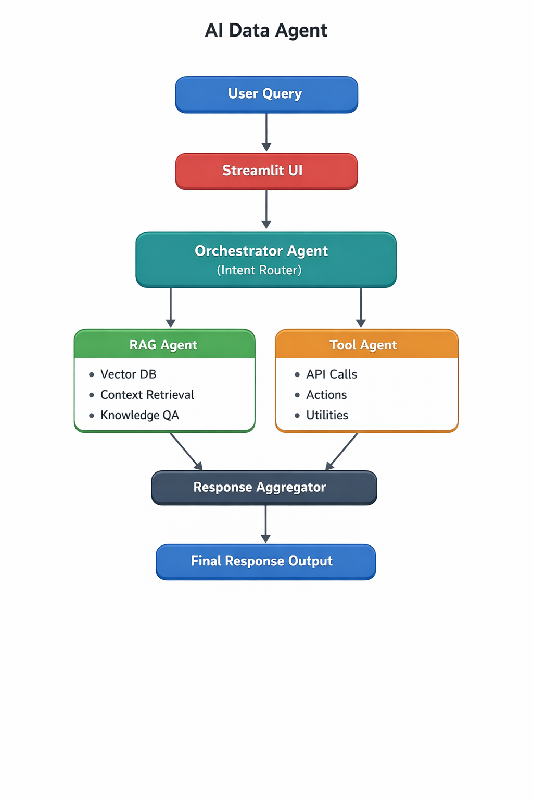

# 🤖 AI Data Agent — Multi-Agent GenAI System

A modular **Agentic AI system** that evolved from a basic tool-based agent into a full **multi-agent RAG + orchestration + UI system**.

This project demonstrates a real-world progression from:
> Tool-based AI → Data Architecture → GenAI → RAG systems → Multi-agent orchestration → Interactive AI application

---

# 📌 Table of Contents

- [🎯 Project Overview](#-project-overview)
- [🧠 System Evolution (v1 → v3)](#-system-evolution-v1--v3)
- [🏗️ Architecture](#️-architecture)
- [⚙️ Core Components](#️-core-components)
- [🔄 How It Works](#-how-it-works)
- [🚀 Quickstart](#-quickstart)
- [📦 Installation](#-installation)
- [📊 Features](#-features)
- [🧪 Example Use Cases](#-example-use-cases)
- [🔮 Future Improvements](#-future-improvements)

---

# 🎯 Project Overview

The **AI Data Agent** is a multi-agent system designed to intelligently process user queries by routing them to specialized agents.

Instead of relying on a single LLM prompt, the system uses:

- 🧠 Orchestrator Agent (decision layer)
- 📚 RAG Agent (knowledge retrieval layer)
- 🛠 Tool Agent (execution layer)
- 🖥 Streamlit UI (interaction layer)

---

# 🧠 System Evolution (v1 → v3)

This project evolved through multiple stages, gradually transforming from a basic agent system into a full multi-agent GenAI architecture.

---

## 🔹 v1 — Basic Agentic AI System
User / Scheduler
↓
AI Agent (LLM)
↓
Tool Layer (APIs)
↓
Pipeline System (Simulated)
↓
Memory Layer


### ✨ Key Highlights
- Autonomous AI agent for pipeline failure analysis  
- LLM-powered log interpretation  
- Self-healing retry mechanism  
- Modular design (agents, tools, memory)  

---

## 🔹 v2 — Enterprise Data Platform (Architectural Layer)
ADF (Simulated Orchestration)
↓
Bronze Layer (Raw Data)
↓
Silver Layer (Cleaned Data)
↓
Agent Layer (AI Insights)
↓
Gold Layer (Business Output)


### ✨ Key Highlights
- Medallion architecture (Bronze → Silver → Gold)  
- Simulated Databricks-style processing layers  
- ADF-like orchestration pipeline  
- Agentic AI layer for intelligent insights  
- End-to-end data pipeline execution  

---

## 🔹 v3 — Multi-Agent GenAI System (Current)
User Query
↓
Streamlit UI
↓
Orchestrator Agent
                ↓
┌───────────────┬───────────────┐
↓                               ↓
RAG Agent              Tool Agent
┌───────────────┬───────────────┐
                ↓                     
        Response Aggregation Layer
                ↓
           Final Output


### ✨ Key Highlights
- Multi-agent orchestration system  
- RAG-based contextual reasoning  
- Intelligent query routing  
- Config-driven architecture  
- Interactive Streamlit UI  

---

## 🚀 Evolution Summary

| Version | Focus Area | Key Capability |
|--------|-----------|---------------|
| v1 | Agentic AI | Tool-based autonomous system |
| v2 | Data Architecture | Medallion + pipeline orchestration |
| v3 | GenAI System | Multi-agent RAG + orchestration |

---

## 🧠 Key Insight

This evolution reflects real-world system design thinking — starting from simple automation and gradually moving toward scalable AI-driven architectures.

---

## 🏗️ Architecture

The system follows a multi-agent architecture where the Orchestrator dynamically routes queries to specialized agents.

<p align="center">
  
</p>

---

# ⚙️ Core Components

## 🧠 Orchestrator Agent
- Classifies user intent  
- Routes query to correct agent  
- Acts as decision-making layer  

## 📚 RAG Agent
- Retrieves context from knowledge base  
- Uses embeddings + vector search  
- Generates context-aware responses  

## 🛠 Tool Agent
- Executes utility-based tasks  
- Handles action-oriented queries  
- Extensible for APIs/tools  

## 🖥 Streamlit UI
- User interaction layer  
- Sends queries to orchestrator  
- Displays final responses  

---

# 🔄 How It Works

1. User enters a query in Streamlit UI  
2. Orchestrator Agent analyzes intent  
3. System routes query:
   - Knowledge → RAG Agent  
   - Action → Tool Agent  
4. Agent processes request  
5. Response is aggregated and returned  

---

# 🚀 Quickstart

```bash
# Clone repository
git clone https://github.com/dk-0226/ai-data-agent

# Move into project
cd ai-data-agent

# Install dependencies
pip install -r requirements.txt

# Run Streamlit app
streamlit run ui/streamlit_app.py

📦 Installation
Requirements
Python 3.9+
Streamlit
OpenAI API key (if applicable)
Vector DB (FAISS / equivalent if used)

📊 Features
🧠 Multi-Agent Architecture
📚 RAG-based contextual reasoning
🔀 Intelligent query routing
🛠 Tool execution system
⚙️ Config-driven design
🪵 Logging & observability
🖥 Streamlit interface

🧪 Example Use Cases
"What are the latest logs in system?"
"Explain this dataset anomaly"
"Run a diagnostic check"
"Retrieve relevant knowledge from documents"
"Execute tool-based operations"

🔮 Future Improvements
LangGraph-based orchestration upgrade
Memory layer (long-term context retention)
FastAPI backend for production deployment
Docker-based deployment
Agent evaluation + monitoring dashboard

🧠 Key Engineering Insight

This project demonstrates the transition from:

❌ Prompt Engineering
✅ System-Level AI Architecture

It emphasizes:

modularity
scalability
separation of concerns
production-ready design thinking

👨‍💻 Author

Built as part of an exploration into Agentic AI systems, RAG pipelines, and scalable AI architecture design.